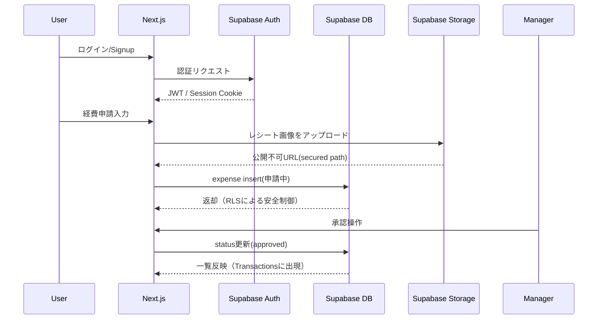

# **Folio アーキテクチャ設計書**

## 1. システム全体構成（概要）

- **開発体制**
  個人開発（1 名）

- **運用方針**

  - 運用コストを限りなくゼロにする
  - 全てのインフラはマネージドサービス（Supabase / Vercel）
  - デプロイは GitHub → Vercel で自動化
  - バックエンドは **BaaS（Supabase）に寄せる → サーバーレス構成**
  - Next.js のみで完結する “フロント＋ BaaS 直結” モノリシック構成

- **設計方針**

  - Multi-tenant（複数チーム）構造を最初から考慮
  - RBAC（Role-Based Access Control）で全操作を権限管理
  - Supabase RLS を活用してセキュアにデータ操作
  - スライドパネルを中心としたモダン UI 設計（shadcn）
  - Edge Functions は必要最低限（招待処理など）

---

## 2. 技術スタック一覧

| 区分                | 採用技術                                                 | 役割・補足                                       |
| :------------------ | :------------------------------------------------------- | :----------------------------------------------- |
| **フロントエンド**  | Next.js 14（App Router） + React + TypeScript            | UI、画面遷移、SSG/SSR/CSR                        |
| 状態管理            | React Query（or Supabase hooks）                         | DB へのフェッチ・キャッシュ統合                  |
| UI\*\*              | shadcn/ui + Tailwind CSS                                 | フォーム、モーダル、データテーブル、Drawer/Sheet |
| 日付                | date-fns                                                 | 日付処理                                         |
| **バックエンド**    | Supabase（PostgreSQL + Auth + Storage + Edge Functions） | Auth、RLS、ファイル管理、DB すべて               |
| 認証                | Supabase Auth（email/password + invite token）           | ユーザー管理                                     |
| インフラ / デプロイ | Vercel                                                   | CDN + Functions + 自動デプロイ                   |
| ストレージ          | Supabase Storage                                         | レシート画像の保存                               |
| CI/CD               | GitHub + Vercel                                          | Push → 自動デプロイ                              |

---

## 3. システム構成図（Mermaid）

Circle Ledger v3 は「Next.js → Supabase に直接アクセスする構造」
＝ バックエンドがない構成だから、図を実際のデータフローに最適化して描き直す。

```mermaid
graph TD
  subgraph Client
    A[Browser / Mobile]
  end

  subgraph App
    B[Next.js (App Router)]
  end

  subgraph Supabase
    SA[Supabase Auth]
    SB[PostgreSQL + RLS]
    SC[Storage (Receipt Images)]
    SD[Edge Functions (Invite, Team Ops)]
  end

  subgraph Hosting
    V[Vercel]
  end

  A --> B
  B --> SA
  B --> SB
  B --> SC
  B --> SD
  B --> V
```

**特徴：**

- 全てのデータ操作は Next.js → Supabase に直接
- 認証は Supabase Auth の Cookie/JWT
- トークンつき invite の処理のみ Edge Functions も検討

---

## 4. 採用技術の選定理由（実用視点）

| 技術                         | 採用理由（重要ポイント）                                                                 |
| :--------------------------- | :--------------------------------------------------------------------------------------- |
| **Next.js (App Router)**     | SSG/SSR/CSR 全部使える。shadcn との親和性が高く、Vercel で爆速デプロイ。                 |
| **Supabase**                 | Auth, DB, Storage が一体。PostgreSQL + RLS で権限管理が強く、multi-team 構造と相性最高。 |
| **Supabase Storage**         | レシート画像のアップロード・URL 発行が簡単で安い。スマホのカメラ起動にも対応。           |
| **RLS (Row Level Security)** | 「チーム外のデータにアクセス禁止」を DB レベルで保証できる。                             |
| **shadcn/ui**                | Drawer/Sheet/Select/Table などが強力。Linear 風の UI に最適。                            |
| **Vercel**                   | デプロイは Git push だけ。SSL/キャッシュ/CDN 自動。                                      |
| **Edge Functions**           | 招待リンクの検証など、フロントに書きたくない処理を分離できる。                           |

---

## 5. データフロー（ログイン〜申請の流れ）



---

## 6. Security 設計の方針（重要）

**RLS（Row Level Security）で絶対条件を enforce する。**

- user は **team_users テーブル**で所属チームを紐付け
- すべてのクエリは `team_id = current_team_id` 条件必須
- approved データは編集禁止（RLS で UPDATE NG）
- Manager/Admin のみ DELETE を許可
- Storage は team_id ごとにバケット or フォルダ分離

---

## 7. コスト試算（現実的運用）

| サービス                    | プラン |      月額      | 備考                      |
| :-------------------------- | :----- | :------------: | :------------------------ |
| Vercel                      | Free   |       ¥0       | 商用 OK                   |
| Supabase（DB+Auth+Storage） | Free   |       ¥0       | レシート数百枚/月なら余裕 |
| ドメイン                    | 任意   |  ¥100〜150/月  | 必要なら                  |
| 合計                        | -      | **¥0〜150/月** | ほぼ無料                  |

※年間で 2000 円以内で運用可能
※実質無料 SaaS 開発が可能

---

## 8. 今後の拡張方針（技術）

- 負荷増加 → Supabase Pro プランにアップグレード
- Edge Functions 増加で「招待・承認ログ・Webhook」などの拡張
- BFF（Backend For Frontend）方式に移行可能（必要なら）
- 多言語化（i18n）
- モバイルアプリ化（React Native or Expo）
- 管理者向けダッシュボード拡張
