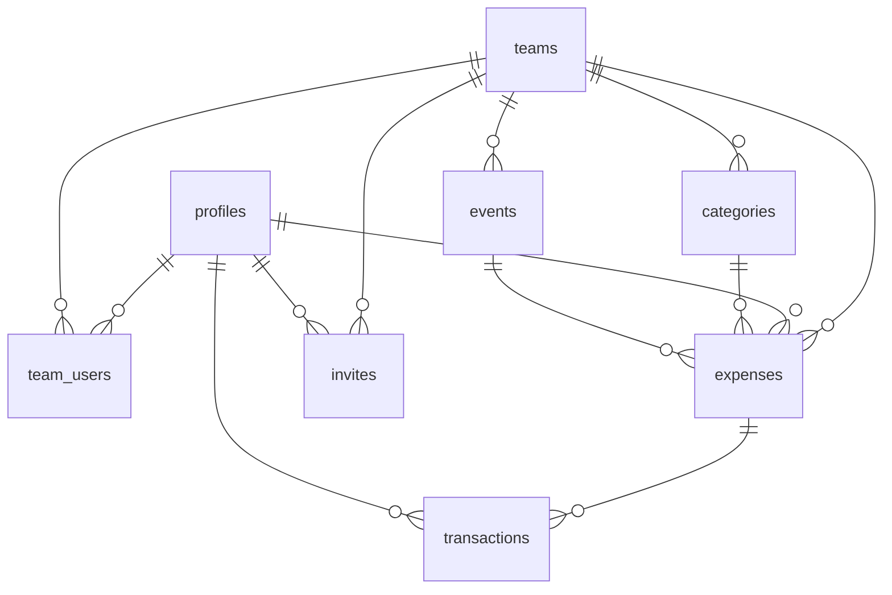

# **Folio データベース設計書**

## 1. 設計方針

- **BaaS（Supabase / PostgreSQL）前提**
  Auth / DB / Storage をフル活用
- **マルチチーム（multi-tenant）構造**

  - 全データは team_id でスコープ
  - ユーザーは「複数チームに所属可能」

- **RBAC（Role-based access control）**

  - admin / manager / member / viewer
  - 将来的に増減しても耐えられる設計

- **RLS (Row Level Security) でデータ保護**

  - チーム外のデータは絶対に参照不可
  - ロールによる UPDATE/DELETE の権限を制御

- **修正のしやすさを最優先**
  → 正規化しすぎず、わかりやすい形

---

# **2. テーブル一覧**

| テーブル名       | 概要                                    | 必須度 |
| :--------------- | :-------------------------------------- | :----: |
| **auth.users**   | Supabase Auth 標準ユーザーテーブル      |   ★    |
| **profiles**     | アプリ内のユーザー情報                  |   ★    |
| **teams**        | チーム（サークル）                      |   ★    |
| **team_users**   | ユーザーとチームの紐付け + ロール       |   ★    |
| **categories**   | 支出カテゴリ（プリセット + チーム拡張） |   ★    |
| **events**       | イベント（任意）                        |   ★    |
| **expenses**     | 支出/収入の申請データ（支出明細）       |   ★    |
| **transactions** | 承認後に確定した取引履歴                |   ★    |
| **invites**      | 招待情報（invite_token）                |   ★    |

※MVP ではこの 9 テーブルで完璧に回せる。

---

# **3. 主要テーブル定義（DDL レベルで詳細に）**

---

## **3-1. profiles（ユーザー情報）**

Supabase Auth を拡張するユーザーデータ。

| カラム名   | 型        | 制約                    | 説明             |
| :--------- | :-------- | :---------------------- | :--------------- |
| id         | UUID      | PK / FK → auth.users.id | Auth と 1:1      |
| name       | TEXT      | NOT NULL                | 表示名           |
| avatar_url | TEXT      | NULL                    | プロフィール画像 |
| theme      | TEXT      | DEFAULT 'default'       | テーマカラー     |
| created_at | TIMESTAMP | DEFAULT now()           | 作成日時         |

---

## **3-2. teams（チーム）**

| カラム名   | 型        | 制約             | 説明           |
| :--------- | :-------- | :--------------- | :------------- |
| id         | UUID      | PK               | チーム ID      |
| name       | TEXT      | NOT NULL         | チーム名       |
| icon       | TEXT      | NULL             | チームアイコン |
| created_by | UUID      | FK → profiles.id | 作成者         |
| created_at | TIMESTAMP | DEFAULT now()    | 作成日時       |

---

## **3-3. team_users（中間テーブル / ロール管理）**

| カラム     | 型        | 制約                                                 | 説明       |
| :--------- | :-------- | :--------------------------------------------------- | :--------- |
| id         | UUID      | PK                                                   |            |
| team_id    | UUID      | FK → teams.id                                        | 所属チーム |
| user_id    | UUID      | FK → profiles.id                                     | メンバー   |
| role       | TEXT      | CHECK(role IN ('admin','manager','member','viewer')) | ロール     |
| created_at | TIMESTAMP | DEFAULT now()                                        |            |

**制約：**
1 ユーザーはチーム内に一度だけ `UNIQUE(team_id, user_id)`

---

## **3-4. categories（カテゴリ）**

チーム固有カテゴリ ＋ プリセットの両対応。

| カラム     | 型           | 制約                      | 説明       |
| :--------- | :----------- | :------------------------ | :--------- |
| id         | UUID         | PK                        |            |
| team_id    | UUID or NULL | NULL → プリセットカテゴリ |            |
| name       | TEXT         | NOT NULL                  | カテゴリ名 |
| created_by | UUID         | FK → profiles.id          |            |
| created_at | TIMESTAMP    | DEFAULT now()             |            |

---

## **3-5. events（イベント）**

イベント紐付けは任意（NULL 可）

| カラム     | 型        | 制約             | 説明       |
| :--------- | :-------- | :--------------- | :--------- |
| id         | UUID      | PK               |            |
| team_id    | UUID      | FK → teams.id    |            |
| name       | TEXT      | NOT NULL         | イベント名 |
| date       | DATE      | NULL             | イベント日 |
| created_by | UUID      | FK → profiles.id |            |
| created_at | TIMESTAMP | DEFAULT now()    |            |

---

## **3-6. expenses（申請データ / 承認前）**

Circle Ledger の最重要テーブル。

| カラム      | 型        | 制約                                             | 説明           |
| :---------- | :-------- | :----------------------------------------------- | :------------- |
| id          | UUID      | PK                                               |                |
| team_id     | UUID      | FK → teams.id                                    | 必須           |
| date        | DATE      | NOT NULL                                         | 申請日         |
| amount      | INTEGER   | NOT NULL                                         | 金額           |
| type        | TEXT      | CHECK ('expense' or 'income')                    | 支出/収入      |
| category_id | UUID      | FK → categories.id                               |                |
| event_id    | UUID      | FK → events.id, NULL 可                          | 任意           |
| created_by  | UUID      | FK → profiles.id                                 |                |
| status      | TEXT      | CHECK('draft','submitted','approved','rejected') | 申請ステータス |
| memo        | TEXT      | NULL                                             |                |
| receipt_url | TEXT      | NULL                                             | ストレージ URL |
| created_at  | TIMESTAMP | DEFAULT now()                                    |                |
| updated_at  | TIMESTAMP | DEFAULT now()                                    |                |

---

## **3-7. transactions（確定済取引）**

承認された expense が複製される形。

| カラム      | 型        | 制約               | 説明 |
| :---------- | :-------- | :----------------- | :--- |
| id          | UUID      | PK                 |      |
| team_id     | UUID      | FK → teams.id      |      |
| expense_id  | UUID      | FK → expenses.id   |      |
| date        | DATE      | NOT NULL           |      |
| amount      | INTEGER   | NOT NULL           |      |
| type        | TEXT      | 支出/収入          |      |
| category_id | UUID      | FK → categories.id |      |
| event_id    | UUID      | NULL               |      |
| created_by  | UUID      | FK → profiles.id   |      |
| approved_by | UUID      | FK → profiles.id   |      |
| created_at  | TIMESTAMP | DEFAULT now()      |      |

---

## **3-8. invites（招待テーブル）**

|カラム|型|制約|説明|
|token|UUID|PK|招待用トークン（URL に乗せる）|
|team_id|UUID|FK → teams.id||
|role|TEXT|default 'member'|初期ロール|
|email|TEXT|NULL|特定メール限定招待もできる|
|expires_at|TIMESTAMP|有効期限|
|created_by|UUID|FK → profiles.id||
|created_at|TIMESTAMP|DEFAULT now()||

---

# **4. リレーション図（ERD）**



---

# **5. RLS（Row Level Security）設計方針**

### 💡 これが Circle Ledger v3 の「強み」になる部分

### **基本ポリシー**

```
team_id IN (
  SELECT team_id
  FROM team_users
  WHERE user_id = auth.uid()
)
```

### **権限（role）ごとの操作制限**

| 操作                | admin |       manager       | member | viewer |
| :------------------ | :---: | :-----------------: | :----: | :----: |
| 自分の expense 作成 |   ◯   |          ◯          |   ◯    |   ×    |
| 自分の expense 編集 |   ◯   |          ◯          |   ◯    |   ×    |
| 他人の expense 編集 |   ◯   | △（submitted まで） |   ×    |   ×    |
| expense 削除        |   ◯   |  △（自分の only）   |   ×    |   ×    |
| 承認/拒否           |   ◯   |          ◯          |   ×    |   ×    |
| transactions 閲覧   |   ◯   |          ◯          |   ◯    |   ◯    |
| team info 編集      |   ◯   |          ×          |   ×    |   ×    |

※ manager の範囲はあなたと相談して調整可能。

---

# **6. 現状の実装（lib/schemas.ts）との整合**

UI で既に扱っているスキーマを優先し、設計上の差分を明示する。

- Expense: `id, date, amount, type, category, event?, createdBy, status, memo?, receiptUrl?, approvalComment?`（team_id 未使用）。
- Transaction: `id, date, amount, type, category, event?, createdBy, memo?, receiptUrl?`（approved_by, team_id 未使用）。
- User: `id, name, email, role, status, joinedAt, lastLogin`（team_id 未使用）。

現行 UI 前提は「単一チーム前提」で、multi-tenant 用の `team_id` や invites 周りのカラムがまだフロントで消費されていない。API 接続フェーズで以下を順に対応する:

1. `team_id` をフロントのデータモデルに追加し、current_team コンテキストと紐付ける。
2. `approved_by` など承認情報を Transaction 表示に組み込む。
3. invites / role 変更など管理系 UI で不足カラムを扱えるようにする。

---

# **6. 今後の拡張**

| 追加予定                | 理由                                        |
| :---------------------- | :------------------------------------------ |
| audit_logs              | 変更履歴（承認/拒否ログ）を残せるようになる |
| budget（予算管理）      | 上限の設定・残高計算                        |
| tags                    | カテゴリを超えたタグ分類                    |
| webhooks                | Slack 通知などの連携                        |
| attachments（複数画像） | 複数レシート対応                            |
