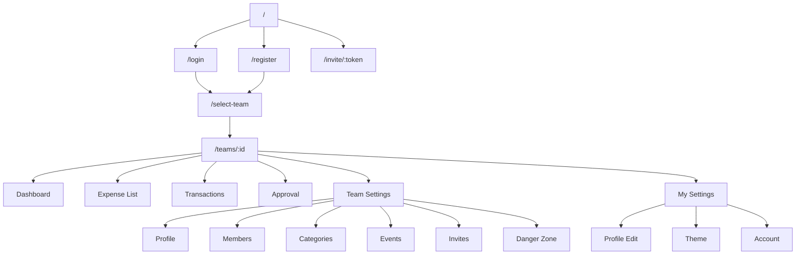

# **Folio サイトマップ設計書**

## 1. 設計方針

- **multi-team SaaS** を前提としたルーティング
- **App Router** に最適化された構造
  → `(dashboard)` / `settings` / `teams/[teamId]` など分割
- 必要なページだけを表示
  → チーム未所属 → "所属チーム選択" 専用画面を出す
- **ロール別で UI を出し分ける**
- **スライドパネル（Sheet）はページ扱いにしない**
  → あくまで UI コンポーネント

---

# **2. ページ一覧（本番仕様）**

## **認証前**

| パス             | ページ名       | 概要                       | 認証 | 備考                             |
| :--------------- | :------------- | :------------------------- | :--: | :------------------------------- |
| `/`              | トップ（LP）   | サービス説明、ログイン導線 | 不要 | 最低限で OK                      |
| `/login`         | ログイン       | メール or Magic Link       | 不要 |                                  |
| `/register`      | 新規登録       | Auth signup                | 不要 |                                  |
| `/invite/:token` | 招待リンク処理 | チーム参加                 | 不要 | token に紐づく team に結びつける |

---

## **認証後・チーム選択前**

| パス           | ページ名   | 概要                  | 認証 | 備考                         |
| :------------- | :--------- | :-------------------- | :--: | :--------------------------- |
| `/select-team` | チーム選択 | 所属チーム一覧 → 選択 | 必要 | 1 チームしかなければ自動遷移 |

---

---

# **3. チーム配下ページ構成（/teams/[teamId]/**）\*\*

基本ルート：

```
/teams/[teamId]/(dashboard)/...
```

サイドバーのメインメニューに対応。

---

# **A. Dashboard（メイン）**

| パス                   | ページ名       | 概要                      | 認証 | ロール |
| :--------------------- | :------------- | :------------------------ | :--: | :----: |
| `/teams/dashboard/:id` | ダッシュボード | 支出/収入の概要、サマリー | 必要 |  全員  |

---

# **B. Expense List（申請一覧）**

| パス                      | 概要                                                |   ロール    |
| :------------------------ | :-------------------------------------------------- | :---------: |
| `/teams/:id/expense-list` | 申請一覧（draft / submitted / approved / rejected） | member 以上 |
| **UI**                    | フィルタ・ソート・スライドパネル                    |             |

---

# **C. Transactions（確定取引一覧）**

|パス|概要|ロール|
|`/teams/:id/transactions`|承認済みの取引履歴一覧|viewer 以上|

---

# **D. Approval（承認管理）**

| パス                  | 概要                           |     ロール      |
| :-------------------- | :----------------------------- | :-------------: |
| `/teams/:id/approval` | 承認対象一覧（submitted のみ） | manager / admin |

※差戻し・承認は actions から実行。

---

# **E. Team Settings（チーム設定）**

| パス                             | ページ名           | 概要                   |     ロール      |
| :------------------------------- | :----------------- | :--------------------- | :-------------: |
| `/teams/:id/settings`            | Team Settings TOP  | 各種管理の入口         |  manager 以上   |
| `/teams/:id/settings/profile`    | チーム基本情報編集 | チーム名・アイコン     |  manager 以上   |
| `/teams/:id/settings/members`    | メンバー管理       | ロール変更・削除       | manager / admin |
| `/teams/:id/settings/categories` | カテゴリ設定       | プリセット + 追加      |  manager 以上   |
| `/teams/:id/settings/events`     | イベント設定       | 追加/削除              |  manager 以上   |
| `/teams/:id/settings/invites`    | 招待リンク管理     | 発行・無効化           |      admin      |
| `/teams/:id/settings/danger`     | Danger Zone        | チーム削除・所有権移譲 |      admin      |

---

# **F. My Settings（個人設定）**

サイドバーではなく、右上メニューから遷移。

| パス             | ページ名                    | 概要                         |
| :--------------- | :-------------------------- | :--------------------------- |
| `/me`            | プロフィール編集            | 名前、アイコン、テーマカラー |
| `/me/appearance` | テーマ編集                  | 選択式（default, ocean…）    |
| `/me/account`    | ログアウト / アカウント関連 |                              |

---

---

# **4. 全体サイトマップ（Mermaid 図）**



---

# **5. サイドバー構成（実際の UI 通り）**

```
=== Team Switcher ===

Dashboard
Expense List
Transactions
Approval  ← manager と admin のみ

--- Settings ---
Team Settings
My Settings
```

※ Team Settings の中はページとして深く入ったときのみ表示
（linear と同じ挙動）

---

# **6. ロールによるメニュー表示制御**

| ページ        | viewer | member | manager | admin |
| :------------ | :----: | :----: | :-----: | :---: |
| Dashboard     |   ◯    |   ◯    |    ◯    |   ◯   |
| Expense List  |   ×    |   ◯    |    ◯    |   ◯   |
| Transactions  |   ◯    |   ◯    |    ◯    |   ◯   |
| Approval      |   ×    |   ×    |    ◯    |   ◯   |
| Team Settings |   ×    |   ×    |    ◯    |   ◯   |
| Invite        |   ×    |   ×    |    ×    |   ◯   |
| Danger Zone   |   ×    |   ×    |    ×    |   ◯   |

---

# **7. スライドパネル（Sheet）の扱い**

以下は _ページではなく UI コンポーネント_ として設置：

- ExpenseSheet（Expense List の詳細・編集）
- TransactionSheet
- MemberRoleSheet
- CategoryEditSheet
- EventEditSheet

ルーティングに含めないため sitemap には載せない。
